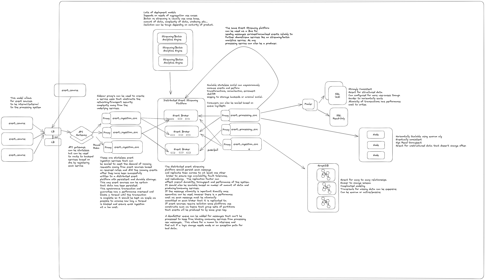

# {{ $frontmatter.title }}

As organizations rely more heavily on real-time logging and analytics platforms, the need for a robust and efficient event processing pipeline becomes paramount. Having spent years working with enterprise solutions like LogRhythm, I've gained insight into the architecture behind reliable event processing systems. These systems must balance scalability, cost-effectiveness, and reliability while supporting a wide variety of use cases, including multi-tenancy.

In this post, I'll break down the components of a simplified real-time event processing pipeline and how they work together to deliver the reliability and scalability businesses need.

## Core Components of an Event Processing Pipeline

At a high level, most event processing architectures follow similar patterns to ensure that data is reliably received, processed, and stored without any loss. Here’s a typical flow:

1. **Event Collection:**

    The first step in any event processing pipeline involves agents or services responsible for collecting events from various sources. These sources can include servers, applications, and devices. Collection methods often rely on either push or pull mechanisms, depending on the use case. The agents either receive events passively or actively poll for them.

2. **Batching and Aggregation:**

    Once events are collected, agents typically batch or aggregate them to optimize throughput and reduce network overhead. In some cases, the events are temporarily persisted on the client side until they receive an acknowledgment (ACK) from the upstream ingestion service. This ensures that no data is lost in transit, even in the event of a network disruption or other failure.

3. **Scalable Ingestion Service:**

    The ingested events are then routed to a stateless, highly available ingestion service. This service can scale horizontally to handle varying incoming event rates, making it essential for managing spikes in event traffic. Typically, events are transmitted over the network via protocols like HTTP or GRPC, depending on the architecture.

1. **Durable Event Storage:**

    A key step in ensuring data reliability is writing the events to a durable and performant storage layer, such as a distributed event streaming platform like Kafka. Kafka provides features like data replication, fault tolerance, and high availability, ensuring that event data is safely stored and easily retrievable. The transaction between the client and the ingestion service is only considered complete once the data has been persisted, offering strong guarantees against data loss.

1. **Downstream Processing and Scalability:**

    With the data securely stored, various downstream services and applications can then consume the events asynchronously. These services might include data enrichment, normalization, ordering, archival, analysis, and storage. The beauty of this architecture is that each of these components can scale independently, allowing the pipeline to support different use cases with ease.

## Why This Architecture Works

This simplified architecture is designed with several key goals in mind:

- **Reliability:** Each component is built to prevent data loss, from the initial collection to durable storage.
- **Scalability:** Stateless services and distributed storage allow the system to scale horizontally, supporting everything from small-scale deployments to enterprise-level loads.
- **Cost Efficiency:** By aggregating events and allowing for asynchronous processing, the system optimizes resource usage, reducing overall costs.
- **Multi-Tenancy:** The flexibility of this architecture makes it easy to extend support for multiple tenants, each with potentially different use cases and resource requirements.

## Bringing It All Together

To further visualize how these components fit together in an event processing pipeline, take a look at the diagram below. It illustrates how events flow from initial collection to final storage and processing, all while maintaining reliability and scalability.

By implementing an event processing pipeline like this, you can ensure that your real-time data is handled efficiently and securely, no matter how large your dataset grows or how complex your use cases become.

