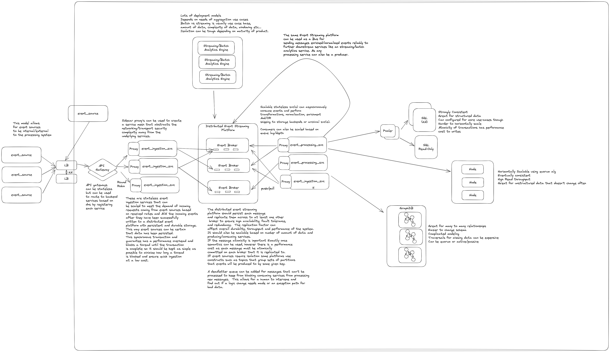

# Event Processing Pipeline and Data Mesh Architectures

A simplified real-time event processing pipeline architecture to minimize increase reliability, enable scalability, reduce costs, widen use-case support, and support multi-tenancy.

As an avid user of enterprise real-time logging and analytics platforms like LogRhythm, I have spent a lot of time with event processing platforms.  The general architecture usually follows the same core patterns/processes to reliably receive events while protecting against data loss:

1. There are agents or services that receive or actively collect events through push or pull mechanisms from various sources.
2. Agents then batch/aggregate these events, sometimes persisting them on the client side until they are ACK'd by an upstream ingestion service.
3. A stateless highly available ingestion service, that can scale based on incoming rates, receive batches of events over the network (i.e. HTTP/GRPC).  
4. The transaction to client doesn't complete until the events are written to a durable and performant storage layer, i.e. a distributed event streaming platform like Kafka.  The goal is to have the event data persisted, replicated, highly available and easily consumable.
5. Downstream services, apps, and datastores can independently scale and asynchronously consume, enrich, normalize, order, archive, analyze and store the data according to use case.

To further illustrate what an event processing pipeline and data mesh like this would look like, check out the below diagram.

